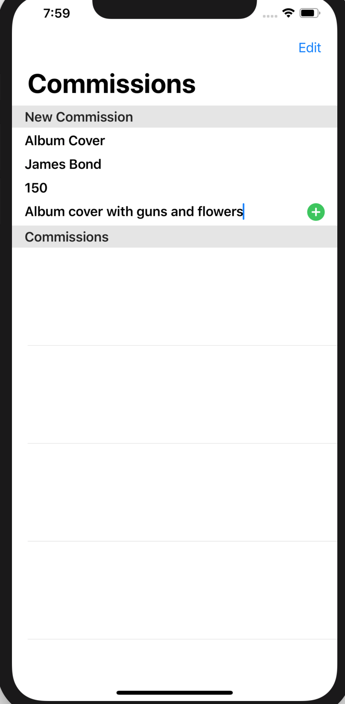
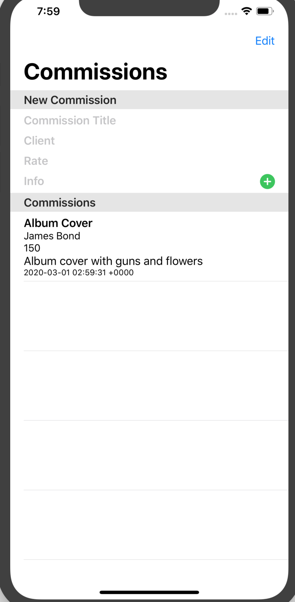

### Deadline 2/28/2020
## Planned Requirements for this deadline
- App running with basic functionality
- Pre-made commissions in home view
- Commission object
- Data Model for Commission in Swift SQLite
- Hardcode a few data points
- Home page pulling and displaying commissions from database 
- Figure out how to make node interactable, displaying correct information for each commission in database
- DB setup (data models made) with Swift project 
- Look into saving database file local

## Completed Requirements for this deadline
- App running with basic functionalility
- Ability to add and delete a commission with basic entered info
- Commissions are stored via CoreData 
- Home page pulling existing commissions previously entered
- Commissions ordered by date created

**The biggest difference is I made a total pivot in project structure. After much struggle with SQLite and Storyboards, I switched over to the newer SwiftUI and CoreData duo. This made for a much different way of handling data and thus different approaches to previous problens.**

## Next deadline plan
- Previously the next step was to add the ability to add a commission to a database and have it correctly displayed, but that was completed on this deadline.
- Instead, my next step is to add the ability to complete a commission (aside from deleting it), and have a seperate page to view those commissions which have been completed. 
- When completing a commission, I want the user to be able enter the final rate and hours spent. 

