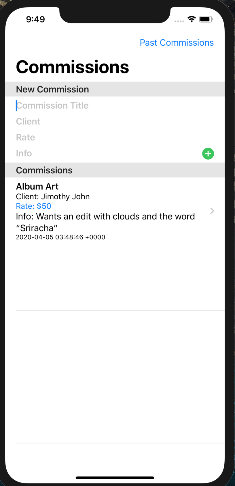
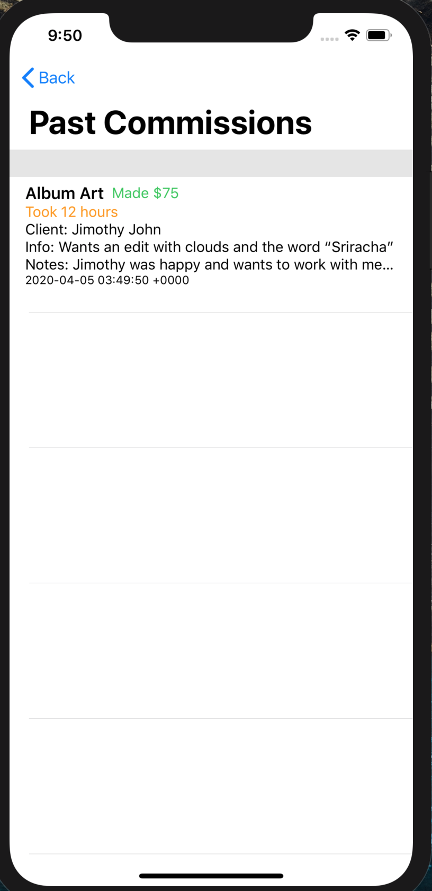

### Deadline 4/3/2020
## Planned Requirements for this deadline
- Add the ability to complete a commission, including a seperate view and places to enter hours spent, the final rate, and any notes.
- Create a new data model that holds the completed commissions
- Add a seperate view which displays a user's completed commissions

## Completed Requirements for this deadline
- Added ability to complete a commission by clicking an entry on the home page, entering the above information and clicking complete.
- Created new data model called "DoneItem"
- Added a "Past Commissions" button on the top right. When clicked, it takes you to a new view where it displays a user's completed commissions

**Bug: Completing a commission does not remove it from the ToDoItem data model. Haven't been able to figure this one out, more complicated than it seems.**

## Next deadline plan
- Add a Basic Metric View to the Past Commissions View
- Try to get some remote User Testing done with at least 2 people
- Fix the bug described above.

